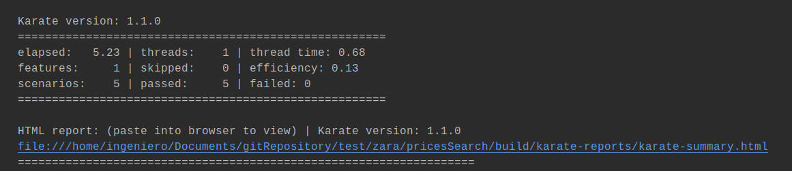

# PRICES SEARCH API

Application to get the prices of products, searching in a date-time band.  

## Requirements to deploy
1. The backend was developed in Java 11.0.17 from <a href="https://aws.amazon.com/es/corretto/?filtered-posts.sort-by=item.additionalFields.createdDate&filtered-posts.sort-order=desc"> Amazon-Corretto</a>.
2. The IDE to develop the app was IntelliJ <a href="https://www.jetbrains.com/idea/download/#section=windows"> IntelliJ IDEA</a> (optional).
3. The end-to-end test was developed with the framework <a href="https://karatelabs.github.io/karate/">karate</a> 
4. The gradle version was 6.8 <a href="https://gradle.org/">gradle home</a>

## E2E Karate Test
* From command line using Gradle ...
1. You can go to the root directory of the project using the command line and execute the gradle commands  gradle test , You will be able to see the trace of the test and the report URL in the console logs. 
2. If you don't have installed Gradle, you will be able to  use the wrapper version of it, with the command   ./gradlew clean test, You will be able to see the trace of the test and the report URL in the console logs.
   

## Documentation
* The documentation and design were develop following <a href="https://www.openapis.org/">  OpenAPI 3.0 standard </a> so you can paste the content of the file <a href="https://github.com/lectrapb/pricesSearch/blob/main/documentation/Especification/SeachPricesEspecificationOpenApi.yaml"> SeachPricesEspecificationOpenApi.yaml </a> in the swagger <a href="https://editor.swagger.io/">editor</a> and you will be able to see the API specification.  
* You can use the <a href="https://github.com/lectrapb/pricesSearch/tree/main/documentation/PostmanCollection"> Postman collection </a> to test the app. 